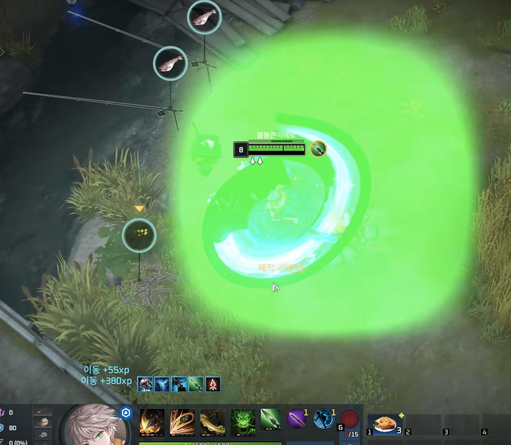
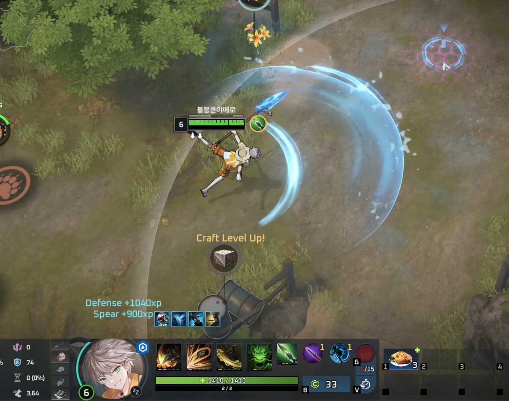

# BDIH 启动器

  <a href="../../README.MD">English</a> |
  <a href="./KR.MD">한국어</a> |
  <a href="./JP.MD">日本語</a> |
  <b>简体中文</b>

  

  
  

  
  

<h3 align="center">发布渠道</h3>

<table align="center">
  <thead>
    <tr>
      <th>渠道</th>
      <th>最新版本</th>
      <th>最新版本下载量</th>
    </tr>
  </thead>
  <tbody>
    <tr>
      <td align="center"><b>Stable</b></td>
      <td align="left">
        
      </td>
      <td align="left">
        
      </td>
    </tr>
    <tr>
      <td align="center"><b>Beta</b></td>
      <td align="left">
        
      </td>
      <td align="left">
        
      </td>
    </tr>
    <tr>
      <td align="center"><b>Staging</b></td>
      <td align="left">
        
      </td>
      <td align="left">
        
      </td>
    </tr>
    <tr>
      <td align="center"><b>Nightly</b></td>
      <td align="left">
        
      </td>
      <td align="left">
        
      </td>
    </tr>
  </tbody>
</table>

  

<h3 align="center">构建状态</h3>

  
  
  
  

专为在 macOS 上畅玩《永恒轮回》和 HoYoverse 游戏而打造的启动器。

**如果使用过程中账号被封禁，或在排位赛中游戏崩溃，开发者概不负责（非常重要）。**

  

  <b>注意事项</b> 
  能够安装 Steam 并不代表所有 Steam 游戏都可以运行。 
  目前唯一保证可以启动的 Steam 游戏是《永恒轮回》。 
  强烈建议使用 CodeWeavers CrossOver。 
  本启动器的主要目的是防止渲染和视觉效果异常。 

# 主要功能

- 修复闪烁和错误渲染的视觉效果。
- 集中管理 Wine、DXMT、Bottle、Prefix、游戏启动器和启动参数。
- 支持 Stable、Beta 和 Nightly 更新渠道。

<h3 align="center">效果对比</h3>

<table align="center">
  <thead>
    <tr>
      <th>角色技能效果</th>
      <th>原始效果</th>
      <th>修复后</th>
    </tr>
  </thead>
  <tbody>
    <tr>
      <td align="center"><b>Felix</b></td>
      <td align="center">
        
      </td>
      <td align="center">
        
      </td>
    </tr>
    <tr>
      <td align="center"><b>Haze</b></td>
      <td align="center">
        
      </td>
      <td align="center">
        
      </td>
    </tr>
  </tbody>
</table>

## 安装方法

详细的安装步骤请参阅项目主页。

## Wine 与 DXMT 提供方

[Custom CrossOver builds](https://github.com/Bob-Ddong-Iri-Hoyo/fullbodied-anca-wine-house)
: 为本启动器维护的 CrossOver 自定义 Wine 构建，基于 Wine 11 和 CrossOver 26.0.0 或更高版本。

[Official Wine](https://www.winehq.org/)
: Wine 官方项目。

[DXMT](https://github.com/3Shain/dxmt)
: 直接使用 Metal 的 Direct3D 11 转换层。

## 参考项目

构建 Wine 运行环境和启动器时参考的项目与资料：

[CodeWeavers](https://www.codeweavers.com/)
: CrossOver 的开发公司。

[Gcenx Wine](https://github.com/Gcenx/macOS_Wine_builds)
: 由 Gcenx 维护的 macOS Wine 构建。

[YAAGL](https://github.com/yaagl/yet-another-anime-game-launcher)
: 面向 macOS 的 HoYoverse 游戏启动器。

[MacPorts Wine](https://github.com/riverfog7/macports-wine)
: 推测由 YAAGL 使用的 Wine 补丁集。

[Anime Game Launcher](https://github.com/an-anime-team/an-anime-game-launcher)
: 面向 Linux 的 HoYoverse 游戏启动器。

[Dawn Winery](https://dawn.wine/dawn-winery)
: 面向动漫风格游戏的 Wine 构建与补丁。

[Proton](https://github.com/valvesoftware/proton)
: Valve 基于 Wine 开发的兼容工具。

## 资源目录

[Anca Wine House](https://github.com/Bob-Ddong-Iri-Hoyo/fullbodied-anca-wine-house/releases)
: 供 BDIH Launcher 和个人使用的 Wine 版本。

[Custom DXMT builds](https://github.com/Bob-Ddong-Iri-Hoyo/anka-snack-house/releases)
: 供 BDIH Launcher 使用的自定义 DXMT 版本，包括针对《永恒轮回》的补丁。

# 许可证

MIT License

Copyright (c) 2026 fabyday

Permission is hereby granted, free of charge, to any person obtaining a copy
of this software and associated documentation files (the "Software"), to deal
in the Software without restriction, including without limitation the rights
to use, copy, modify, merge, publish, distribute, sublicense, and/or sell
copies of the Software, and to permit persons to whom the Software is
furnished to do so, subject to the following conditions:

The above copyright notice and this permission notice shall be included in all
copies or substantial portions of the Software.

THE SOFTWARE IS PROVIDED "AS IS", WITHOUT WARRANTY OF ANY KIND, EXPRESS OR
IMPLIED, INCLUDING BUT NOT LIMITED TO THE WARRANTIES OF MERCHANTABILITY,
FITNESS FOR A PARTICULAR PURPOSE AND NONINFRINGEMENT. IN NO EVENT SHALL THE
AUTHORS OR COPYRIGHT HOLDERS BE LIABLE FOR ANY CLAIM, DAMAGES OR OTHER
LIABILITY, WHETHER IN AN ACTION OF CONTRACT, TORT OR OTHERWISE, ARISING FROM,
OUT OF OR IN CONNECTION WITH THE SOFTWARE OR THE USE OR OTHER DEALINGS IN THE
SOFTWARE.
